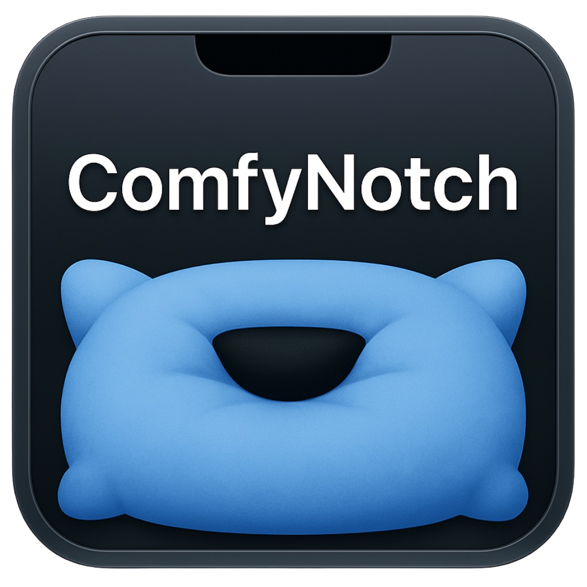

# 🚀 ComfyNotch

[](https://swift.org)
[](https://developer.apple.com/xcode/)
[](https://apple.com/macos/)


> Turn your MacBook’s notch into a **beautifully functional and customizable space**.



## 📚 Table of Contents
- [🎥 Live Demo](#live-demo-)
- [📦 Download](#-download)
- [📖 About](#-about)
- [🎉 Features](#-features)
- [⚙️ Metal Animations](#️-metal-animations)
- [⚠️ Known Issues](#️-known-issues)
- [✅ Planned Features & Improvements](#-planned-features--improvements)
- [📦 Build From Source](#-build-from-source)


_✨ Watch ComfyNotch bring your MacBook’s notch to life ✨_

## 📦 Download

> ⚠️ Not on the App Store - Not Planning on it being on the App Store — but super easy to run!

1. Go to the [**Releases tab**](https://github.com/AryanRogye/ComfyNotch/releases)
2. Download the latest `.zip` file (e.g. `ComfyNotch-v0.1.0.dmg`)
3. Double-click to open it

🧠 *Why?*
ComfyNotch uses Private Frameworks and I want to look into adding more
I have provided a DMG that users can download ...or you can [build it yourself from source.](#-build-from-source)

---

## 📖 About

ComfyNotch brings life to your MacBook’s notch by providing a clean and intuitive way to interact with widgets and other functionalities. It’s all about making your Mac **feel comfy and stylish**. 

---

## 🎉 Features

- ✅ **Widgets**: Music Player, Camera Widget, Notes, Time Display, and more!
- 🎵 **Music Control**: Easily control your music playback with slick visual indicators.
- 📋 **Clipboard Manager**: Keep track of your recent copies like a pro.
- 🗂️ **File Tray**: Access your files directly from the notch.
- 📅 **Apple Calendar Integration**: View your events and reminders directly from your notch
- 📝 **Notes Widget**: Keep quick notes accessible from the notch.
- ⏰ **Time Widget**: Always know the time with style.
- 🔄 **Smooth Animations**: Every interaction feels satisfying.
- 📷 **Camera**: See how your looking in public

### 🪄 Smart Notch Hiding (You’ve never seen this before)

Hold down a modifier key (e.g. ⌘ or ⌥) and hover near the notch —  
ComfyNotch will temporarily hide itself so you can access toolbar elements underneath.

> Currently Not Working (cuz I reworked everything and wanna get a actual swiftpm to manage this)

Perfect for apps with chunky UIs like Xcode, Finder, or Final Cut.

> 🔥 Pretty sure no other notch utility does this.


## Live Demo 🎥

> https://github.com/user-attachments/assets/03f213db-cb36-4a2b-92c2-c580f07ed741

> ⚠️ *Note:* This video shows a old build, Honestly, I kinda hate recording demos — there’s too much to show and it never captures everything.
> ComfyNotch is under active development, so the features and visuals in your download might look a bit different!

_Volume/Brightness Controls_
> 

_Messages_
> 

_FileTray_
> with Everything that can go wrong

> 

_Notch Width Change_
> https://github.com/user-attachments/assets/49be94da-219a-44f1-84e6-2b6b693b73aa


## ⚙️ Metal Animations

[🔗 View Metal Animation Demo v0.1.23](https://github.com/AryanRogye/ComfyNotch/releases/tag/0.1.23)


## ⚠️ Known Issues
   - ⚠️ **Volume controls** don’t work reliably on all macOS versions — avoid using them unless you really dislike the default OSD (`OSDUIHelper`).
   
---

## ✅ **Planned Features & Improvements**

- [ ] **Pomodoro Timer**: Add a Pomodoro timer to help users manage their time effectively.
- [ ] **Better Shortcut Management**: Implement a better shortcut management system to allow users to customize their shortcuts easily.
- [ ] Easily add your own widgets.
- [ ] **Connectivity** allow output of playback to change/show change of playback

---

## 📦 Build From Source

### 💻 **Clone and Build**
```bash
git clone https://github.com/AryanRogye/ComfyNotch.git
cd ComfyNotch
open ComfyNotch.xcodeproj
```

- Open the project in Xcode
- Select the target `ComfyNotch` in the project navigator
- Build the project (Cmd + B)
- Run the project (Cmd + R)

- **Note:** You may need to set up your signing certificate in Xcode.
- Products > Archive > Distribute App > Developer ID
