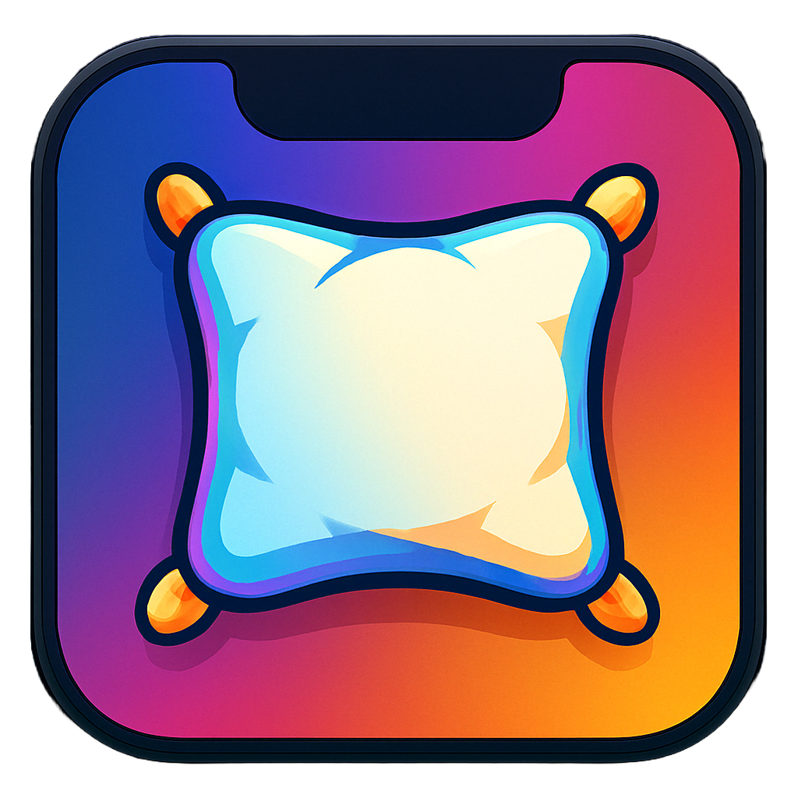

# 🚀 ComfyNotch

> Turn your MacBook’s notch into a **beautifully functional and customizable space**.



---

## 📖 About

ComfyNotch brings life to your MacBook’s notch by providing a clean and intuitive way to interact with widgets and other functionalities. It’s all about making your Mac **feel comfy and stylish**. 

---

## 🎉 Features

- ✅ **Widgets**: Music Player, Camera Widget, Notes, Time Display, and more!
- 🎵 **Music Control**: Easily control your music playback with slick visual indicators.
- 📝 **Notes Widget**: Keep quick notes accessible from the notch.
- ⏰ **Time Widget**: Always know the time with style.
- 🔄 **Smooth Animations**: Every interaction feels satisfying.
- 📷 **Camera**: See how your looking in public
- 🎨 **Coming Soon: Customization**: Easily add your own widgets.


---

## ✅ **Planned Features & Improvements**

### 🔧 **Functionality Enhancements**
- [ ] **App Restart on Display Changes**: Automatically restart the app when monitors are plugged in or unplugged.
- [ ] **Hide App Icon**: Hide app icon at all times, no need to bother the users dock
- [ ] **Album View When Closed**: Display album art in a mini view when the panel is closed.
- [ ] **Music Playing Indicator**: Add a smooth icon animation to indicate when music is playing.

### 🎨 **UI/UX Improvements**
- [ ] **Better Settings Menu**: Revamp the settings view for easier customization and better user experience.

---

## 📦 Installation

### 💻 **Clone and Build**
```bash
git clone https://github.com/YourUsername/ComfyNotch.git
cd ComfyNotch
./scripts/build_app.sh